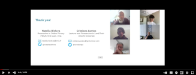
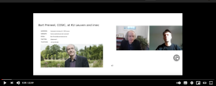

## CIF Seminars @ KU Leuven

A monthly series of interdisciplinary seminars around legal and technical
topics related to cybersecurity and online privacy, organised by the
[CiTiP](https://www.law.kuleuven.be/citip/en/),
[COSIC](https://www.esat.kuleuven.be/cosic/), and
[DistriNET](https://distrinet.cs.kuleuven.be/) research groups of [KU
Leuven](https://www.kuleuven.be/). We thank the [Weizenbaum
Institute](https://www.weizenbaum-institut.de/) for logistic and technical
support. Subscribe to our [mailing
list](https://cif-seminars.github.io/#contact--mailing-list) or follow us
on Twitter
[#CIFSeminarsKUL](https://twitter.com/search?q=%23CIFSeminarsKUL&f=live)
for talk announcements.  A playlist with all the recorded sessions is
available on
[YouTube](https://www.youtube.com/playlist?list=PLiHaXFHjrqYcMjR1bIKIpnJdA_3EFJoCR),
presentation slides are available below.  All dates and times are in
Brussels, Belgium time zone, CET/CEST. 

* This will become a table of contents (this text will be scrapped).
{:toc}

---

  
## Upcoming Seminars

* **Tuesday, 24 January 2023:** [Predictive Policing and the Defense Rights
  Against Criminal Risk Assessment (by Dr. Irmak Erdogan
Peter)](https://cif-seminars.github.io/#predictive-policing-and-the-defense-rights-against-criminal-risk-assessment-by-dr-irmak-erdogan-peter)

---

  
## Next Seminar

<!--
Oh no! We might be out of talks? No, not really. Upcoming seminars will be
anounced soon.
-->

<!-- ***Template***
### Title (by )

| **When** | Tuesday, 30 June 2020, 12:30 - 13:30 |
| --- | --- |
| **Location** | online only |
| **Conferencing** | [https://collocall.weizenbaum-institut.de/b/jan-2lf-teo-i6a](https://collocall.weizenbaum-institut.de/b/jan-2lf-teo-i6a) |
| **Abstract** | |
-->

### Predictive Policing and the Defense Rights Against Criminal Risk Assessment (by Dr. [Irmak Erdogan Peter](https://www.law.kuleuven.be/citip/en/staff-members/staff/00157508))

| **When** | Tuesday, 24 January 2023, 12:30 - 13:30 CET |
| --- | --- |
| **Location** | imec-CiTiP, [Sint-Michielsstraat 6](https://www.law.kuleuven.be/citip/en/contact), Leuven -- Room 02.07 (Babbelbox) |
| **Conferencing** | [https://collocall.weizenbaum-institut.de/b/jan-2lf-teo-i6a](https://collocall.weizenbaum-institut.de/b/jan-2lf-teo-i6a) |
| **Abstract** | The modern actuarial techniques constitute a revival of the power of the state to categorize, identify and apprehend “would-be offenders.” The promise of “stopping crime before it happens” has spread the use of predictive analytics, which regroup massive amounts of data and emerge profiles of people. The risk assessment tools replace the individualized suspicion with an automated, impersonal suspicion and enlarge the scope of criminal procedures to the pre-crime area. Furthermore, it traps the “risky” individuals in a trial system, which keeps them in a continuous investigation process without knowing the grounds for the accusation. After presenting a comprehensive review of these predictive risk analysis tools used in the United States and Europe, this seminar seeks to analyse how profiling technologies differ from traditional criminal procedure measures and discuss the evidential value of the risk scores. Furthermore, it aims to discuss if data protection regulations can be integrated into criminal procedures to protect the rights of suspects/defendants concerning risk profiling technologies. |

---

  
## Previous Seminars, Slides & Recordings

<!-- ***Template***
### Title (by )

| **When** | Tuesday, 30 June 2020, 12:30 - 13:30 |
| --- | --- |
| **Abstract** | |
| **Slides** |  |
| **Recording** |   |
-->

### Ethical Practices for Security Research with At-Risk Populations (by [Vaughn Hamilton](https://twitter.com/vaughncendiary) &amp; Dr. [Angelika Strohmayer](https://www.northumbria.ac.uk/about-us/our-staff/s/angelika-strohmayer/))

| **When** | Tuesday, 20 December 2022, 12:30 - 13:30 CET |
| --- | --- |
| **Abstract** | A growing body of security and privacy research focuses on at-risk populations - those who are marginalized, stigmatized, and/or criminalized - and who may face significant harm from research conducted about themselves and their communities. For example, recent research has studied family members of those in prison, survivors of domestic violence, undocumented immigrants, and sex workers. At-risk communities have a heightened need for confidentiality, consideration for possible past trauma, and research justice given inherent power differentials. Here, we offer a set of ethical research practices we have deployed in research with multiple at-risk communities. We hope these practices will serve as guidance and a springboard for discussion about what it means to conduct ethical research, particularly with marginalized, stigmatized, and/or criminalized groups.   Paper: <a href="https://doi.org/10.1109/EuroSPW55150.2022.00065">https://doi.org/10.1109/EuroSPW55150.2022.00065</a> |

### Addressing Students' Eco-anxiety when Teaching Sustainability in Higher Education (by Prof. [Elina Eriksson](https://www.kth.se/profile/elina) &amp; Prof. [Anne-Kathrin Peters](https://www.kth.se/profile/akpeters))

| **When** | Thursday, 24 November 2022, 12:30 - 13:30 CET |
| --- | --- |
| **Abstract** | The widespread awareness and the sense of urgency and helplessness regarding the ongoing sustainability crisis (climate change, biodiversity loss etc.) can evoke feelings of grief, sorrow, despair and anxiety. Those emotions are seldom discussed in computing or in computing education. They can have detrimental effects on the well-being of students and others, and also lead to inaction. But concern can on the other hand also be a catalyst for learning. In this paper, we present results and reflections from a research and development project in our introductory course to sustainability and ICT focusing on emotions in sustainability education. We focus on “eco-anxiety” and ask: 1) How is eco-anxiety communicated by students and teachers?, 2) In what ways do students receive support to deal with eco-anxiety? and 3) What could be done to better address eco-anxiety in computing education? We here present an analysis of how we have responded to the phenomenon of eco-anxiety, what activities have been added to the course and an evaluation of these interventions. The results are based on joint reflections that have been guided by literature, a small-scale ethnographic study as well as a course evaluation. The paper will end with recommendations for other ICT4S educators on how they can start addressing eco-anxiety in their education.   Paper: [https://doi.org/10.1109/ICT4S55073.2022.00020](https://doi.org/10.1109/ICT4S55073.2022.00020) |

### Implementing privacy requirements in software projects (by [Mykyta Petik](https://www.law.kuleuven.be/citip/en/staff-members/staff/00132505))

| **When** | Thursday, 03 November 2022, 12:30 - 13:30 CET |
| --- | --- |
| **Abstract** | In this presentation, we will explore the data protection by design approach to help developers take care of personal data processing requirements in their projects, specifically in the context of cloud, edge and 5G, and distributed applications in general. We also discuss how to implement GDPR guidelines in a Software Development Life Cycle, and how to involve Data Protection Officers and lawyers in the process.   The implementation of distributed systems that process personal data -- in particular in Software Defined Networking and Network Function Virtualization in 5G networks -- leads to an increase in the importance of reliable privacy-preserving solutions for data protection. Even the most straightforward software dealing with personal data has to take a number of legal issues into account, such as respect for user personal data and adherence to principles governing the processing of personal data enshrined in GDPR. Data protection by design requires considering these factors early in development to avoid costly patches in the future or even the risk of personal data breaches. Developers and software project managers have to adhere to data protection by design principles as well as other personal data processing requirements as well as consider working with data protection officers and lawyers at certain stages of the SDLC. |
| **Slides &** | [20221103-petik-privacy-sdlc.pdf](slides/20221103-petik-privacy-sdlc.pdf) |

### Leaky Forms: A Study of Email and Password Exfiltration Before Form Submission (by [Asuman Senol](https://www.esat.kuleuven.be/cosic/people/asuman-senol/))

| **When** | Thursday, 13 October 2022, 12:30 - 13:30 CEST |
| --- | --- |
| **Abstract** | Web users enter their email addresses into online forms for a variety of reasons, including signing in or signing up for a service or subscribing to a newsletter. While enabling such functionality, email addresses typed into forms can also be collected by third-party scripts even when users change their minds and leave the site without submitting the form. Email addresses—or identifiers derived from them—are known to be used by data brokers and advertisers for cross-site, cross-platform, and persistent identification of potentially unsuspecting individuals. In order to find out whether access to online forms is misused by online trackers, we present a measurement of email and password collection that occurs before the form submission on the top 100,000 websites. We evaluate the effect of user location, browser configuration, and interaction with consent dialogs by comparing results across two vantage points (EU/US), two browser configurations (desktop/mobile), and three consent modes. Our crawler finds and fills email and password fields, monitors the network traffic for leaks, and intercepts script access to filled input fields. Our analyses show that users’ email addresses are exfiltrated to tracking, marketing and analytics domains before form submission and without giving consent on 1,844 websites in the EU crawl and 2,950 websites in the US crawl. While the majority of email addresses are sent to known tracking domains, we further identify 41 tracker domains that are not listed by any of the popular blocklists. Furthermore, we find incidental password collection on 52 websites by third-party session replay scripts.   Paper: [https://www.usenix.org/conference/usenixsecurity22/presentation/senol](https://www.usenix.org/conference/usenixsecurity22/presentation/senol) |
| **Slides &** | [20221013-senol-leakyforms.pdf](slides/20221013-senol-leakyforms.pdf) |
| **Recording** | Below we have the talk and discussion from our CIF
Seminar (we missed the first couple of minutes, apologies) and Asuman's
USENIX 2022 presentation:      |

### Using data while preserving privacy today: the failure of de-identification, the practicability of modern techniques, and anonymity in the GDPR (by [Andrea Gadotti](https://cpg.doc.ic.ac.uk/team/andrea/))

| **When** | Tuesday, 31 May 2022, 12:30 - 13:30 |
| --- | --- |
| **Abstract** | Data can be incredibly useful for innovation, and in particular for business, research and policy-making. Ultimately, data has great potential for the public good. However, the large-scale collection and use of data raises legitimate privacy concerns, especially in light of recent scandals such as the Cambridge Analytica one.   Traditionally, the standard approach to share data while protecting privacy has been de-identification. Yet, research has shown that this practice is not resistant to a wide range of re-identification attacks. In this presentation I will show why traditional de-identification is not practical for modern behavioral datasets ("big data"). I will then discuss how researchers are exploring alternative models to enable the privacy-conscientious use of big data, and why this is a never-ending attack/defense game. Throughout the presentation, I will discuss the policy implications of the technical results, particularly with respect to the concept of "anonymous data", which is outside the scope of the GDPR. |
| **Recording** |   |

### One piece of the puzzle: computational limits and opportunities of anonymity for whistleblower protection (by [Dr. Stefan Schiffner](https://www.researchgate.net/profile/Stefan-Schiffner-2) and  [Prof. Bettina Berendt](https://www.weizenbaum-institut.de/en/portrait/p/bettina-berendt/))

| **When** | Tuesday, 01 March 2022, 12:30 - 13:30 |
| --- | --- |
| **Abstract** | “If the twentieth century was the age of civil disobedience, the twenty-first century is shaping up to be the age of whistleblowing” (Delmas, 2015). However, both private-sector and public-sector whistleblowers continue to experience substantial or even growing pushback and retaliation. Since the fear of retaliation is a major disincentive for new potential whistleblowers, laws are being created to reduce the likelihood of this grave threat. The possibility of anonymous reporting is a controversial topic in the law-making progress, for example in the (ongoing) processes of national implementations of the EU Whistleblower Directive. Within these debates, many theoretical, legal and empirical investigations, and the marketing texts of whistleblower-software “solutions”,  take a very simple-minded view of anonymous reporting channels, essentially regarding anonymity as a binary feature that can be set at will. We argue that this is both an underestimation of what state-of-the-art computer science can deliver and an overestimation (and overselling) of it. In this talk, we will analyze the relation of identification, pseudonymization, and anonymization and their computational limitations. Based on this analysis, we propose that in order to incentivise and protect whistleblowers, anonymity needs to be supplanted by specific whistleblower-protection legislation per se and in interaction with other laws as well as organisational error culture. |
| **Slides &** | [20220301-schiffnerberendt-whistleblowing.pdf](slides/20220301-schiffnerberendt-whistleblowing.pdf) |
| **Recording** |  |

### Why do we need life-cycle thinking in the context of IoT? (by [Thibault Pirson](https://be.linkedin.com/in/thibault-pirson-bb7496195/en))

| **When** | Tuesday, 15 February 2022, 12:30 - 13:30 |
| --- | --- |
| **Abstract** |  In upcoming years, the number of Internet-of-Things (IoT) devices is expected to surge up to tens of billions of physical objects. However, while the IoT is often presented as a promising solution to tackle environmental challenges, the direct environmental impacts generated over the life cycle of the physical devices are usually overlooked. It is often implicitly assumed that their environmental burden is negligible compared to the positive impacts they can generate. Yet, because the roots of electronics fall far short of dematerialization and because IoT calls for a massive deployment of electronic devices in the environment, the associated environmental footprint must be evaluated during the design and deployment of these distributed systems. Some general Life-Cycle Assessment (LCA) methodologies for IoT already exist but quantitative results are still scarce.   The talk therefore focuses on the use of LCA in the field of electronics and more specifically for IoT devices. We first present a [parametric framework based on hardware profiles to evaluate the cradle-togate carbon footprint of IoT edge devices](https://doi.org/10.1016/j.jclepro.2021.128966). It is then used to show that the heterogeneity inherent to IoT edge devices must be considered as the production carbon footprint between simple and complex devices can vary by a factor of more than 150×. Then, we estimate the absolute carbon footprint induced by the worldwide production of IoT edge devices through a macroscopic analysis over a 10-year period. Results range from 22 to more than 1000 MtCO2-eq/year in 2027 depending on the deployment scenarios, which truly stresses the necessity to consider environmental constraints when designing and deploying IoT edge devices. Finally, we focus on a very specific use case to show the relevance of LCA for smart sensors. We compare the environmental performances of a wireless power transfer (WPT) system for room occupancy monitoring and its battery-powered equivalent through a comparative cradle-to-grave LCA over four indicators, i.e. energy, carbon footprint, water and ecotoxicity. The analysis concludes that the WPT system yields significantly higher impacts over all indicators, from a factor 5.6x to 10.9x. |
| **Slides &** | [20220215-pirson-iot.pdf](slides/20220215-pirson-iot.pdf) |
| **Recording** |   |

### Whistleblowing for Change (by [Tatiana Bazzichelli](https://www.disruptionlab.org/))

| **When** | Tuesday, 01 February 2022, 12:30 - 13:30 |
| --- | --- |
| **Abstract** | The courageous acts of whistleblowing that inspired the world over the past few years have changed our perception of surveillance and control in today’s information society. But what are the wider effects of whistleblowing as an act of dissent on politics, society, and the arts? How does it contribute to new courses of action, digital tools, and contents? In this presentation, Tatiana Bazzichelli will introduce the book Whistleblowing for Change: Exposing Systems of Power and Injustice (Nov. 2021). Based on the work of Berlin's Disruption Network Lab and the contributions of 30 authors in the field of whistleblowing and social justice, this book examines this growing phenomenon, offering interdisciplinary pathways to empower the public by investigating whistleblowing as a developing political practice that has the ability to provoke change from within. More info: [Whistleblowing for Change: Exposing Systems of Power &amp; Injustice](https://www.disruptionlab.org/book) (free [EPUB/PDF](https://www.transcript-verlag.de/978-3-8376-5793-7/whistleblowing-for-change/)); Conference: [THE KILL CLOUD: Networked Warfare, Drones & AI](https://www.disruptionlab.org/the-kill-cloud)     *Tatiana Bazzichelli* is founder and director at Disruption Network Lab, an organisation in Berlin examining the intersection of politics, technology, and society. Her focus of work is whistleblowing, network culture, art and hacktivism. She was a member of the Transparency International Anti-Corruption Award Committee 2020. In 2019 she was appointed jury member for the Capital Cultural Fund by the German Federal Government and the city of Berlin, and in 2020 jury member for the Kulturlichter prize, a new award for digital cultural education in Germany. She is the author of the books Whistleblowing for Change (2021), Networked Disruption (2013), Disrupting Business (2013), and Networking (2006). In 2011-2014 she was programme curator at transmediale festival in Berlin. |
| **Slides** | [20220201-bazzichelli-whistleblowing.pdf](slides/20220201-bazzichelli-whistleblowing.pdf) |

### An Audit of Facebook's Political Ad Policy Enforcement (by [Victor Le Pochat](https://distrinet.cs.kuleuven.be/people/VictorLePochat))

| **When** | Thursday, 16 December 2021, 12:30 - 13:30 |
| --- | --- |
| **Abstract** | Major technology companies strive to protect the integrity of political advertising on their platforms by implementing and enforcing self-regulatory policies that impose transparency requirements on political ads. In this paper, we quantify whether Facebook’s current enforcement correctly identifies political ads and ensures compliance by advertisers. In a comprehensive, large-scale analysis of 4.2 million political and 29.6 million non-political ads from 215,030 advertisers, we identify ads correctly detected as political (true positives), ads incorrectly detected (false positives), and ads missed by detection (false negatives). Facebook’s current enforcement appears imprecise: 61% more ads are missed than are detected worldwide, and 55% of U.S. detected ads are in fact non-political. Detection performance is uneven across countries, with some having up to 53 times higher false negative rates among clearly political pages than in the U.S. Moreover, enforcement appears inadequate for preventing systematic violations of political advertising policies: for example, advertisers were able to continue running political ads without disclosing them while they were temporarily prohibited in the U.S. We attribute these flaws to five gaps in Facebook’s current enforcement and transparency implementation, and close with recommendations to improve the security of the online political ad ecosystem.   More information: [https://distrinet.cs.kuleuven.be/news/2021/FBPoliticalAds.jsp](https://distrinet.cs.kuleuven.be/news/2021/FBPoliticalAds.jsp) |
| **Recording** |   |

### Facial recognition in the wild: All Eyes on Clearview AI (by [Dr. Catherine Jasserand](https://www.law.kuleuven.be/citip/en/staff-members/staff/00139789))

| **When** | Thursday, 25 November 2021, 12:30 - 13:30 |
| --- | --- |
| **Abstract** | In January 2020, the New York Times revealed that a facial recognition software company, Clearview AI, had scrapped billions of face images from social media and set up a platform offering services to law enforcement authorities. The revelations triggered a chain of reactions: the company rapidly faced legal challenges in the US, and several data protection authorities started investigations worldwide.   The talk will explain the platform’s functioning before digging into the data protection issues raised by Clearview AI’s practices. It will discuss the interpretation of the extraterritorial scope of the GDPR to apply the GDPR rules to a company neither established nor represented in the EU. It will also explain that law enforcement authorities in the EU lack legal grounds to use the platform (based on the national rules implementing the ‘Law Enforcement Directive’). Finally, it will wrap up with an overview of the legal complaints against the company (in Europe and the US) and against the police authorities using its services (such as in Sweden). |
| **Slides &** | [20211125-jasserand-clearview.pdf](slides/20211125-jasserand-clearview.pdf) |
| **Recording** |   |

### Sex, Work, and Technology: Lessons for Internet Governance & Digital Safety (by [Dr. Elissa M. Redmiles](http://elissaredmiles.com))

| **When** | Thursday, 21 October 2021, 12:30 - 13:30 |
| --- | --- |
| **Abstract** | Sex workers sit at the intersection of multiple marginalized identities and make up a sizable workforce: the UN estimates that at least 42 million sex workers are conducting business across the globe. Sex workers face a unique and significant set of digital, social, political, legal, and safety risks; yet their digital experiences have received little study in the CS and HCI literature. In this talk we will review findings from a 2-year long study examining how sex workers who work in countries where sex work is legal (Germany, Switzerland, the UK) use technology to conduct business and how they have developed digital strategies for staying safe online and offline. We will then describe how these findings can inform broader conversations around internet governance, digital discrimination, and safety protections for other marginalized and vulnerable users whose experiences bisect the digital and physical. |
| **Recording** |   |

### "Hypocrite Commits": what are the legal and ethical limits to cybersecurity research? (by [Ivo Emanuilov](https://twitter.com/IvoEmanuilov))

| **When** | Thursday, 07 October 2021, 12:30 - 13:30 |
| --- | --- |
| **Abstract** | In April 2021, the maintainer of the Linux stable kernel branch, Greg Kroah-Hartman, asked the kernel community to cease accepting patches from the University of Minnesota (UMN) and launched a revision of all previously accepted submissions. The events that led to this strong community reaction start with a paper submitted by a research team at UMN for publication under the title "Hypocrite Commits". The paper is the result of a research project initiated in 2020 which concerned the intentional submission of patches that introduce flaws into the kernel. Indeed, after a reportedly silent period of about seven months, the research team behind this project began to submit patches of notoriously poor quality that were quickly caught by the community. Believing this was an attempted imposture, the community halted acceptance of further UMN contributions to the kernel, prompting immediate re-review of all prior submissions. On 5 May 2021, the Linux Foundation's Technical Advisory Board published a "Report on University of Minnesota Breach-of-Trust Incident" where details of the affair were disclosed and suggestions on how the community can move forward were made, aiming to overcome the conflict.   This talk aims to explore the legal and ethical limits to cybersecurity research through the prism of this recent case and, more generally, open source software projects. Cybersecurity resarch is notorious for its (somewhat undertheorised) ethical issues, such as ethical hacking, responsible vulnerability disclosure, and encryption export controls. Community-driven free and open source software projects are an easy target for dishonest practices. When the concerned project is of the scale and importance of the Linux kernel, however, the question arises whether researchers embarking on such ethically questionable practices also expose themselves to potential legal liability, beyond the curt reprimand delivered by the community anyway. The Linux kernel is often considered the most important open source project in the world; it is vital for the operation of a growing number of safety-critical devices and systems, incl. space exploration missions such as the Perseverance rover. Some may see this as pushing the envelope of this case, yet we cannot but ask whether there are limits to 'hypocrisy' in research when life and limb may be at stake. |
| **Slides &** | [20211007-emanuilov-hypocrite.pdf](slides/20211007-emanuilov-hypocrite.pdf) |
| **Recording** |   |

### Empowerment through self-diagnosis: A critical perspective on the empowerment rhetorics around self-testing apps (by [Alexandra Kapeller](https://liu.se/en/employee/aleka31) and [Iris Loosman](https://research.tue.nl/en/persons/iris-loosman))

| **When** | Tuesday, 07 September 2021, 12:30 - 13:30 |
| --- | --- |
| **Abstract** | Direct-to-consumer self-testing apps offer users the tools to self-check for various medical conditions, giving them access to information about their health status without intervention by health care professionals. These apps gain in popularity and are marketed with promises of empowerment. Although empowerment promises are common in the field of mobile health (mHealth) we argue that these rhetorics do not match with what self-testing apps can offer. We start this article by postulating distinctive features of self-testing apps, contrasting them with other closely related mHealth services. Then, we examine the discourse around empowerment in relation to health, mHealth, and self-testing apps. Third and last, we analyse to what extent self-testing apps can contribute to empowerment in the form of control and knowledge. While empowerment as control in the literature implies control over health decisions, it is presented as control over health itself in self-testing app advertisements. Self-testing apps suggest that health can and should be controlled, while a positive result is a clear example of how there are aspects of the user’s health that are out of their control. Similarly, diagnostic information about a current health status is distinguished from knowledge about how to contextualize the test result. A self-test result is not necessarily empowering users to pursue actions but instead creates situations of vulnerability in which users need guidance and care. Therefore, although not questioning the usefulness of self-testing apps, we disagree that they should be called empowering. |
| **Slides** | [20210907-kapellerloosman-diagnostics.pdf](slides/20210907-kapellerloosman-diagnostics.pdf) |

### Rise of the Robots: Exploring Some Risk and Assurance Challenges for RAS (by [Dr. Nikita Johnson](https://www.linkedin.com/in/nakitajohnson/))

| **When** | Tuesday, 08 June 2021, 12:30 - 13:30 |
| --- | --- |
| **Abstract** | The emergence of robotic and autonomous systems (RAS) in many safety-critical domains has significantly increased the number of assurance and certification challenges. These include (i) technical challenges such as minimising uncertainty, identifying risk and developing approaches for achieving an acceptable level of risk, and (ii) socio-technical challenges such as understanding the impact of RAS on existing concepts, competence needs, processes, tool support, and organisational and regulatory structures. In addition to the challenges for RAS, for existing, 'traditional' systems there are growing concerns about how to identify and manage risk across system safety and cyber security.   In this presentation, using the Safety-Security Assurance Framework (SSAF) approach applied to a real-world example, we explore the implications of uncertainty from both RAS and safety-security interactions. The focus is on the impact on practice, existing organisational structures and risk acceptance. We will conclude by discussing possible solution approaches for each of the challenges raised. |
| **Slides &** | [20210608-njohnson-co-assurance.pdf](slides/20210608-njohnson-co-assurance.pdf) |
| **Recording** |   |

### Web tracking, consent pop-ups and dark patterns: Legal and technical perspectives (by [Prof. Nataliia Bielova](https://twitter.com/nataliabielova) and [Prof. Cristiana Santos](https://twitter.com/cristianapt))

| **When** | Thursday, 06 May 2021, 12:30 - 13:30 |
| --- | --- |
| **Abstract** | As millions of users browse the Web on a daily basis, they become producers of data that are continuously collected by numerous companies and agencies. Website owners, however, need to become compliant with recent EU privacy regulations (such as GDPR and ePrivacy) and often rely on consent pop-ups to either inform users or collect their consent to tracking.   This talk delves into the subject of compliance of tracking technologies and consent pop-ups with the GDPR and ePrivacy Directive, and offers a multi-disciplinary discourse from legal, technical and even design perspective. We present our recent works on detection of Web tracking, compliance of consent pop-ups, and identification of gaps between law, design and technology when dark patterns are used in consent pop-ups.   This talk covers our recent publication in computer science, law and human-computer interaction domains: ["Are cookie banners indeed compliant with the law? Deciphering EU legal requirements on consent and technical means to verify compliance of cookie banners."](https://arxiv.org/abs/1912.07144) (Int. J. on Technology and Regulation, 2020), ["Missed by Filter Lists: Detecting Unknown Third-Party Trackers with Invisible Pixels"](https://arxiv.org/abs/1812.01514) (PoPETS 2020), ["Do Cookie Banners Respect my Choice? Measuring Legal Compliance of Banners from IAB Europe's Transparency and Consent Framework"](https://arxiv.org/abs/1911.09964v1) (IEEE S&P 2020), ["Purposes in IAB Europe’s TCF: which legal basis and how are they used by advertisers?"](https://doi.org/10.1007/978-3-030-55196-4_10) (APF 2020), and ["Dark Patterns and the Legal Requirements ofConsent Banners: An Interaction Criticism Perspective"](https://arxiv.org/abs/2009.10194) (ACM CHI 2021). |
| **Slides &** | [20210506-bielovasantos-tracking.pdf](slides/20210506-bielovasantos-tracking.pdf) |
| **Recording** |   |

### Circumvention of tracking protections by means of first-party tracking (by [Yana Dimova](https://distrinet.cs.kuleuven.be/people/YanaDimova))

| **When** | Tuesday, 06 April 2021, 12:30 - 13:30 |
| --- | --- |
| **Abstract** | When browsing the web, users are continuously exposed to ads. Online trackers place cookies in the user's browser, which are then sent to them on each webpage visit. This practice allows them to build an overview of the browsing behavior and interests of the user in order to provide more relevant ads. These privacy concerns have been met with regulatory frameworks such as GDPR, but also with tools that aim to protect users' privacy such as adblockers and tracking protection features from browsers. As a reaction, trackers are exploring new techniques to circumvent existing privacy-protecting tools. Our work investigates one of those techniques, called CNAME-based tracking. In this scenario, the tracking script is executed on a subdomain of the website, therefore bypassing tracker blocking tools, which mostly rely on a list of known third-party tracking domains. Furthermore, our study shows that, while the popularity of this technique is increasing, it introduces certain threats for users. Personal data of users that is meant to be exclusively shared with the website, is leaking to the trackers. Furthermore, the use of CNAME-based tracking introduces vulnerabilities affecting thousands of websites and their users. Here is a link to our paper on ["The CNAME of the Game: Large-scale Analysis of DNS-based Tracking Evasion"](https://arxiv.org/abs/2102.09301) (PETS 2021). |
| **Slides &** | [20210406-ydimova-cname.pdf](slides/20210406-ydimova-cname.pdf) |
| **Recording** |   |

### Is the law getting outpaced by autonomous vehicles? (by [Charlotte Ducuing](https://www.law.kuleuven.be/citip/en/staff-members/staff/00118922) and [Orian Dheu](https://www.law.kuleuven.be/citip/en/staff-members/staff/00127682))

| **When** | Thursday, 4 March 2021, 12:30 - 13:30 |
| --- | --- |
| **Abstract** | Building on their alleged societal benefits, autonomous vehicles have raised both high hopes and enthusiasm from various stakeholders. Though such complex vehicles are not yet roaming our roads, regulators and policymakers alike have started reflecting on the potential legal and regulatory effects these novel artefacts could have on existing frameworks. This presentation will look at the extent to which the ‘autonomization’ of  cars implies legal and regulatory disruption, more specifically through the lens of a potential shift towards a complex eco-system and the foreseen servitization of road mobility (for instance with MaaS-based business models). With respect to road vehicles, the law indeed plays a major role in ensuring that safety and security are maintained, through i.e. certification, technical regulations and liability. Do AVs disrupt the law in that respect? The following questions will particularly be discussed: First, can we ascertain who is liable in case of AV-caused accident? If so, is it fair for this(ese) person(s) to be held liable and is it in line with the aim to ensure safety and security? Second, do increasing dynamic cybersecurity threats and/or the dynamicity of ML models challenge design-based technical regulations of road vehicles? |
| **Slides &** | [20210304-ducuingdheu-outpaced.pdf](slides/20210304-ducuingdheu-outpaced.pdf) |
| **Recording** |   |

### (De)constructing ethics for autonomous vehicles: What was the question again? (by [Prof. Bettina Berendt](https://people.cs.kuleuven.be/~bettina.berendt/))

| **When** | Thursday, 25 February 2021, 12:30 - 13:30 |
| --- | --- |
| **Abstract** | Autonomous vehicles (AV) have become one of the favourite examples of “AI ethics” debates. They appear to present an excellent real-life application of the [Trolley Problem](https://en.wikipedia.org/wiki/Trolley_problem), a well-known thought experiment in philosophical ethics, and thereby facilitate meaningful debates on machine ethics. In this talk, I want to challenge these assumptions and report on alternatives tried in various settings involving computer scientists and others interested in AI ethics (teaching and workshops). The goal is to engage engineers in reflecting on their work, and ultimately to help them transform these reflections into creating different systems-with-AI.   I will briefly describe the simple (but wide-spread) idea that the AV should “decide whom to sacrifice in an accident dilemma situation”, argue why it is misleading, but also illustrate how the topic can be used differently towards more productive AI-ethics discussions. Among other things, productive discussions should question what the question (regarding autonomous cars or other issues) is. I will describe adversarial and deconstructive methods for opening AI-ethics discussions, show example results of applying them to AV problems, highlight the role of domain knowledge (including multi-disciplinary aspects such as legal questions), and close with many open questions – which I look forward to investigating together with you! |
| **Slides &** | [20210225-bberendt-autonomous.pdf](slides/20210225-bberendt-autonomous.pdf) |
| **Recording** |  |

### Proximity tracing with Coronalert: lessons learned (by [Prof. Bart Preneel](https://homes.esat.kuleuven.be/~preneel/))

| **When** | Tuesday, 09 February 2021, 12:30 - 13:30 |
| --- | --- |
| **Abstract** | The corona pandemic is the first major pandemic in times of big data, AI and smart devices. Some nations have deployed these technologies a large scale to support a trace/quarantine/test/isolate strategy in order to contain a pandemic. However, serious concerns have been raised w.r.t. the privacy implications of some solutions, which makes them incompatible with privacy and human rights that are protected by EU law. This talk focuses on the proximity tracing solution developed by the DP-3T (Distributed Privacy-Preserving Proximity Tracing) consortium. This app has been rolled out in more than 40 countries and states, with support of Google and Apple. We will provide some details on the experience with the Coronalert app in Belgium that is connected to the European Federated Gateway Service, which at this moment has 11 EU countries and more than 40 million users. The talk will discuss the lessons learned from this large-scale deployment in which the principles of privacy-by-design and data minimization have played a central role. |
| **Recording** |   |

### Recent developments concerning confidentiality of communications and the use of technology to combat child sexual abuse online (by [Dr Brendan Van Alsenoy](https://be.linkedin.com/in/brendan-van-alsenoy-a400994))

| **When** | Tuesday, 19 January 2021, 12:30 - 13:30 |
| --- | --- |
| **Abstract** | On 10 September 2020, the Commission published a Proposal for a Regulation on a temporary derogation from certain provisions of the ePrivacy Directive (2002/58) /EC as regards the use of technologies for the purpose of combatting child sexual abuse online by "number-independent interpersonal communications services". The measures envisaged by the Proposal would constitute an interference with the fundamental rights to respect for private life and data protection of all users of very popular electronic communications services, such as instant messaging platforms and applications.   This seminar will discuss the main considerations and recommendations provided by the EDPS in Opinion 7/2020 in relation to the Commission Proposal, including the safeguards that are necessary to ensure that the persons whose personal data is affected have sufficient guarantees that data will be effectively protected against the risk of abuse.   As the EDPS underlines in its Opinion, the issues at stake are not specific to the fight against child abuse but to any initiative aiming at collaboration of the private sector for law enforcement purposes. If adopted, the Proposal, will inevitably serve as a precedent for future legislation in this field. |
| **Slides &** | [20210119-bvanalsenoy-confidentiality.pdf](slides/20210119-bvanalsenoy-confidentiality.pdf) |
| **Recording** |  |

### Technological testing Grounds: Migration Management Experiments from the Ground Up (by [Dr. Petra Molnar](https://twitter.com/_pmolnar?lang=en))

| **When** | Wednesday, 6 January 2021, 12:30 - 13:30 |
| --- | --- |
| **Abstract** | Technology is increasingly being used at the border. From drones to Big Data to algorithms, countries are turning to novel techniques to ‘manage’ migration. However, often these technological experiments do not consider the profound human rights ramifications and real impacts on human lives. Join us for a discussion of a new report, [Technological Testing Grounds](https://edri.org/wp-content/uploads/2020/11/Technological-Testing-Grounds.pdf) on interviews with refugees and people on the move and highlighting the panopticon of increasing surveillance and automation at the border. |
| **Slides &** | [20210106-pmolnar-migration.pdf](slides/20210106-pmolnar-migration.pdf) |
| **Recording** |   |

### Cyber security from technological research to offensive (mis)appropriation (by [Erik Zouave](https://uk.linkedin.com/in/eriktristanzouave))

| **When** | Thursday, 17 December 2020, 12:30 - 13:30 |
| --- | --- |
| **Abstract** | Research on cyber technology is largely undertaken with the aim of increasing the security of systems, software, users, and society at large. At least that is the conclusion that might be drawn from research and research investments in the public domain. However, as a matter of law, regulators recognize that some types of technologies are inherently “dual use”. Moreover, many more cyber technologies than those explicitly regulated as “dual use” can become part and parcel of future “offensive” end-use and criminal misuse. Open AI’s cancelled release of the GPT-2 natural language model is arguably a case in point. While many researchers may be aware of an international “arms race” between states and criminal technological trade on “black markets”, insights of how security research fits into this development is more complex. This seminar aims to broaden researcher’s perspective of how cyber security technologies can have “offensive” end-uses and can be at risk of misuse. It further exemplifies formalized systems of development, dissemination and trade that may further “offensive” exploitation and sometimes result in misuse. Finally, the challenges to formulating effective legal responses to unwanted end uses of technology, such as through export controls, cybercrime law, data protection, and vulnerability equities or disclosure, is addressed. |
| **Slides &** | [20201217-ezouave-offensive.pdf](slides/20201217-ezouave-offensive.pdf) |
| **Recording** |   |

### Privacy by Design (by [Dr. Laurens Sion](https://sion.info/))

| **When** | Tuesday, 17 November 2020, 12:30 - 13:30 |
| --- | --- |
| **Abstract** | Building software-intensive systems that respect the fundamental rights to privacy and data protection requires explicitly addressing data protection issues at the early development stages. Data Protection by Design (DPbD)—as coined by Article 25(1) of the General Data Protection Regulation (GDPR)—therefore calls for an iterative approach based on (i) the notion of risk to data subjects, (ii) a close collaboration between the involved stakeholders, and (iii) accountable decision-making.   In practice, however, the legal reasoning behind DPbD is often conducted on the basis of informal system descriptions that lack systematicity and reproducibility. This affects the quality of Data Protection Impact Assessments (DPIA)—i. e. the concrete manifestation of DPbD at the organizational level. This is a major stumbling block when it comes to conducting a comprehensive and durable assessment of the risks that takes both the legal and technical complexities into account.   In this talk, I present DPMF: a data protection modeling framework that allows for a comprehensive and accurate description of the data processing operations in terms of the key concepts used in the GDPR. The proposed modeling approach accommodates a number of legal reasonings and assessments that are commonly addressed in a DPIA exercise (e. g., the compatibility of purposes). The DPMF is supported in a prototype modeling tool and its practical applicability is validated in the context of a realistic eHealth system for a number of complementary development scenarios. |
| **Slides &** | [20201117-lsion-dpbd.pdf](slides/20201117-lsion-dpbd.pdf) |
| **Recording** |  |

### Compelled Decryption (by [Dr. Sofie Royer](https://www.law.kuleuven.be/citip/en/staff-members/staff/00105310) and [Ward Yperman](https://www.law.kuleuven.be/strafrecht/english/LedenpaginasENGELS/wyENGELS.html))

| **When** | Thursday, 29 October 2020, 12:30 - 13:30 |
| --- | --- |
| **Abstract** | You have the right to remain silent! But what does that mean when you are forced to provide your smartphone password (or fingerprint) to the police? This is a question many scholars and courts alike have grappled with. The right to remain silent and not incriminate oneself is one of the basic principles of our legal system. While this right seems fairly straightforward, technological change comes with new challenges. In this talk, Sofie Royer and Ward Yperman will explain the scope of the right to silence and shed light on the rules on compelled decryption in Belgium and beyond. This includes the consequences of refusing to provide your password and the countermeasures that one can take in order to protect oneself. |
| **Slides &** | [20201029-sroyer-compelled.pdf](slides/20201029-sroyer-compelled.pdf) |
| **Recording** |   |

### Watching IoTs That Watch Us: Empirically Studying IoT Security & Privacy at Scale (by [Prof. Danny Y. Huang](https://mlab.engineering.nyu.edu/))

| **When** | Friday, 16 October 2020, 12:30 - 13:30 |
| --- | --- |
| **Abstract** | Consumers today are increasingly concerned about the security and privacy risks of smart home IoT devices. However, few empirical studies have looked at these problems at scale, partly because a large variety and number of smart-home IoT devices are often closed-source and on private home networks, thus making it difficult for researchers to systematically observe the actual security and privacy issues faced by users in the wild. In this talk, I describe two methods for researchers to empirically understand these risks to real end-users: (i) crowdsourcing network traffic from thousands of real smart home networks, and (ii) emulating user-inputs to study how thousands of smart TV apps track viewers. Both methods have allowed us to conduct the largest security and privacy studies on smart TVs and other IoT devices to date. Our labeled datasets have also created new opportunities for other research areas, such as machine learning, network management, and healthcare. |
| **Slides &** | [20201016-dhuang-watching-iots.pdf](slides/20201016-dhuang-watching-iots.pdf) |
| **Recording** |   |

### LINDDUN GO: A lightweight approach to privacy threat modeling (by [Dr. Kim Wuyts](https://distrinet.cs.kuleuven.be/people/kim))

| **When** | Tuesday, 29 September 2020, 12:30 - 13:30 |
| --- | --- |
| **Abstract** | In this talk, Kim will present LINDDUN GO, a toolkit for lightweight privacy threat modeling. In the first part of this talk, we will look into threat modeling in general and learn more about the LINDDUN privacy threat modeling framework. We will zoom into the main privacy threat categories encompassed in LINDDUN and walk through the LINDDUN methodology. In the second part of the talk, LINDDUN GO, the lightweight variant, will be introduced. |
| **Slides &** | [20200929-kwuyts-linddun-go.pdf](slides/20200929-kwuyts-linddun-go.pdf) |
| **Recording** |  |

### The full force of the state: predictive policing interventions (by [Fieke Jansen](https://datajusticelab.org/people/))

| **When** | Monday, 17 August 2020, 12:30 - 13:30 |
| --- | --- |
| **Abstract** | In this seminar, Fieke will talk about the need to for contextualization when discussing the effective, fair and legitimate of predictive policing. She will start her presentation with an introduction into predictive policing, its imaginaries, uses and challenges. The seminar will then outline some of the key assumptions on which predictive policing is based. All audiences are welcome: no prior knowledge of the police or technology is required for this seminar. |
| **Slides &** | [20200817-fjansen-policing.pdf](slides/20200817-fjansen-policing.pdf) |
| **Recording** |   |

### (In-)Security of Implantable Medical Devices (by [Dr. Eduard Marin Fabregas](https://www.esat.kuleuven.be/cosic/people/eduard-marin-fabregas/))

| **When** | Friday, 17 July 2020, 12:30 - 13:30 |
| --- | --- |
| **Abstract** | In this seminar, Eduard will give a talk on the security of medical devices. Eduard will begin by explaining the evolution of medical devices and how this opens the door for security attacks. Afterwards, he will talk about our experience analyzing the security of several implantable medical devices such as pacemakers, insulin pumps and neurostimulators. Finally there will be room for some legal observations by Elisabetta and Erik, the speakers of the seminar of Thursday, 16 July 2020 on "Cybersecurity of Medical Devices: Legal and Ethical Challenges". |
| **Slides &** | [20200717-emarin-medical-insec.pdf](slides/20200717-emarin-medical-insec.pdf) |
| **Recording** |   |

### Cybersecurity of Medical Devices: Legal and Ethical Challenges (by [Elisabetta Biasin](https://www.law.kuleuven.be/citip/en/staff-members/staff/00121994) and [Erik Kamenjašević](https://www.law.kuleuven.be/citip/en/staff-members/staff/00117938))

| **When** | Thursday, 16 July 2020, 12:30 - 13:30 |
| --- | --- |
| **Abstract** | In this seminar, Elisabetta and Erik will talk about the cybersecurity of medical devices from the legal and ethical perspectives. They will start their presentation by defining a medical device and how it relates to EU cybersecurity norms stemming from different pieces of legislation. The seminar will then outline some of the most pressing ethical concerns and explain how the existing cybersecurity legal framework could mitigate these. All audiences are welcome: no prior knowledge of the law is required for this seminar. |
| **Slides &** | [20200716-ebiasin-medical-legal.pdf](slides/20200716-ebiasin-medical-legal.pdf) |
| **Recording** |  |

### Homomorphic Encryption (by [Prof. Dr. Nigel Smart](https://www.esat.kuleuven.be/cosic/people/nigel-smart/))

| **When** | Tuesday, 30 June 2020, 12:30 -- 13:30 |
| --- | --- |
| **Abstract** | In this seminar, Prof. Dr. Nigel Smart will give a talk on computing on encrypted data. He will discuss how the technology of MPC and FHE is changing the way people process data, by allowing them to compute on data whilst it is “encrypted”. He will discuss a number of use cases of the technology. The talk will not go into technical details, and thus you do not need to understand any cryptography for the talk. |
| **Slides &** | [20200630-smart-homomorphic-crypto.pdf](slides/20200630-smart-homomorphic-crypto.pdf) |
| **Recording** |  |

### Ethical Hacking (by [Dr. Sofie Royer](https://www.law.kuleuven.be/citip/en/staff-members/staff/00105310))

| **When** | Tuesday, 05 May 2020, 12:30 -- 13:30 |
| --- | --- |
| **Abstract** | In this seminar, Sofie Royer will give a talk on hacking and its legal implications. We'll first have a look at the basics of criminal law and criminal procedure. What does the offence of hacking look like? Are there any European rules on this topic? From which point can someone be held criminally liable for his or her behavior? Who can decide whether a criminal investigation is initiated? What punishment does someone risk when he or she is found liable for hacking? Does ethical hacking constitute an offence in Belgium? What about other countries? In other words, in this seminar you’ll find out what’s at stake when engaging in hacking activities. |
| **Slides** | [20200505-sroyer-ethical-hacking.pdf](slides/20200505-sroyer-ethical-hacking.pdf) |

### Threat modeling: A guided tour (by [Dr. Koen Yskout](https://distrinet.cs.kuleuven.be/people/koeny))

| **When** | Wednesday, 08 April 2020, 12:30 -- 13:30 |
| --- | --- |
| **Abstract** | In this talk, we'll take a tour through the current state of practice regarding threat modeling in software engineering. Starting from the goal of threat modeling, we'll encounter the relation between threats and objectives, risk, design decisions, vulnerabilities, and exploits. We'll look at a few typical threats to software systems, and practical techniques to elicit them (e.g., attack trees, attack libraries, STRIDE, and LINDDUN). We'll finish by  discussing some of the limitations of and hurdles for doing threat  modeling in a modern software development lifecycle and enterprise  environment. |
| **Slides** | [20200408-kyskout-threat-modeling.pdf](slides/20200408-kyskout-threat-modeling.pdf) |

### The NIS-Directive and the Cybersecurity Act (by [Stefano Fantin](https://www.law.kuleuven.be/citip/en/staff-members/staff/00118311) and [Michiel Fierens](https://www.law.kuleuven.be/citip/en/staff-members/staff/00132752))

| **When** | Tuesday, 03 March 2020, 12:30 -- 13:30 |
| --- | --- |
| **Abstract** | The aim of this presentation is to provide some basic inputs about the most recent legislation on cybersecurity issued by the EU. More specifically, the first part of the presentation will give an overview of the policy landscape that led the law-maker to legislate back in 2015-2016. Having set up the basis (inter alia, touching upon some fundamentals of EU law), we will go through the main parts of the NIS Directive, what obligations the law entails on Member States and economic actors (including on incident reporting), and what lessons we can learn from it. The second part of the presentation will brief on the newly introduced Cybersecurity Act, which regulates on the role of ENISA and a pan-European cybersecurity certification scheme. Finally, we will provide a small overview on how a future EU certification scheme could look like on the basis of the recent ENISA-report. |
| **Slides &** | [20200303-fantin-fierens-nis-cybersec.pdf](slides/20200303-fantin-fierens-nis-cybersec.pdf) |
| **Recording**|  |

### Trusted Execution and how far you can trust it (by [Dr. Jan Tobias Muehlberg](https://distrinet.cs.kuleuven.be/people/muehlber))

| **When** | Tuesday, 07 February 2020, 12:00 -- 13:00 |
| --- | --- |
| **Abstract** | Even the most well-tested software is not secure if it executes on untrusted infrastructure, in an untrusted operating system, or relies on third-party libraries that may contain vulnerabilities. Modern processors provide Trusted Execution Environments (TEEs) that can protect a software component from low-level attacks, allows remote parties to verify the integrity of that component, and ties execution of the component to a unique trusted element in the execution platform. In this talk Dr. Jan Tobias Muehlberg will give an introduction to software-level vulnerabilities and TEEs, and discuss the security and privacy implications of this technology. |
| **Slides** | [20200207-jtmuehlberg-trusted-computing.pdf](slides/20200207-jtmuehlberg-trusted-computing.pdf) |

---

  
## Contact & Mailing List

Talk announcements are published on this website, on Twitter under
[#CIFSeminarsKUL](https://twitter.com/search?q=%23CIFSeminarsKUL&f=live) and on
the CIF-Seminars mailinglist. Email [CiTiP
Admin](mailto:law.citip.admin@kuleuven.be) to subscribe.

The series is organised by [Jan Tobias
Muehlberg](https://distrinet.cs.kuleuven.be/people/muehlber) (DistriNet),
[Benedikt
Gierlichs](https://www.esat.kuleuven.be/cosic/people/benedikt-gierlichs/)
(COSIC) and [Sofie
Royer](https://www.law.kuleuven.be/citip/en/staff-members/staff/00105310)
(CiTiP). Get in touch with us if you have questions or suggestions.

Thanks go to [Bettina
Berendt](https://www.weizenbaum-institut.de/portrait/p/bettina-berendt/)
and the Weizenbaum Institute for providing us with a [BBB](https://bigbluebutton.org/) instance as a privacy-preserving open-source solution for hosting online seminars.

