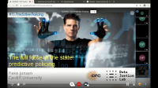
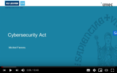

## CIF Seminars @ KU Leuven

A monthly series of interdisciplinary seminars around legal and technical
topics related to cybersecurity and online privacy, organised by the
[CiTiP](https://www.law.kuleuven.be/citip/en/),
[COSIC](https://www.esat.kuleuven.be/cosic/), and
[DistriNET](https://distrinet.cs.kuleuven.be/) research groups of [KU
Leuven](https://www.kuleuven.be/). A playlist with all the recorded
sessions is available on [YouTube](https://www.youtube.com/playlist?list=PLiHaXFHjrqYcMjR1bIKIpnJdA_3EFJoCR), presentation slides are available below.
All dates and times are in Brussels, Belgium time zone, CET/CEST.

* This will become a table of contents (this text will be scrapped).
{:toc}

## Upcoming Seminars

* Tuesday, 22 June 2021: Accountable software vulnerability handling: between responsible state behavior and just intelligence norms (by Stefano Fantin)

<!--
Oh no! We might be out of talks? No, not really. Upcoming seminars will be
anounced soon.
-->

## Next Seminar

<!-- ***Template***
### Title (by )

| **When** | Tuesday, 30 June 2020, 12:30 - 13:30 |
| --- | --- |
| **Location** | online only |
| **Conferencing** | [https://bbb.tbm.tudelft.nl/b/jan-ajw-cov-fzj](https://bbb.tbm.tudelft.nl/b/jan-ajw-cov-fzj) |
| **Abstract** | |
-->

### Web tracking, consent pop-ups and dark patterns: Legal and technical perspectives (by [Nataliia Bielova](https://twitter.com/nataliabielova) and [Cristiana Santos](https://twitter.com/cristianapt))

| **When** | Thursday, 06 May 2021, 12:30 - 13:30 |
| --- | --- |
| **Location** | online only |
| **Conferencing** | [https://bbb.tbm.tudelft.nl/b/jan-ajw-cov-fzj](https://bbb.tbm.tudelft.nl/b/jan-ajw-cov-fzj) |
| **Abstract** | As millions of users browse the Web on a daily basis, they become producers of data that are continuously collected by numerous companies and agencies. Website owners, however, need to become compliant with recent EU privacy regulations (such as GDPR and ePrivacy) and often rely on consent pop-ups to either inform users or collect their consent to tracking.   This talk delves into the subject of compliance of tracking technologies and consent pop-ups with the GDPR and ePrivacy Directive, and offers a multi-disciplinary discourse from legal, technical and even design perspective. We present our recent works on detection of Web tracking, compliance of consent pop-ups, and identification of gaps between law, design and technology when dark patterns are used in consent pop-ups.   This talk covers our recent publication in computer science, law and human-computer interaction domains: ["Are cookie banners indeed compliant with the law? Deciphering EU legal requirements on consent and technical means to verify compliance of cookie banners."](https://arxiv.org/abs/1912.07144), ["Missed by Filter Lists: Detecting Unknown Third-Party Trackers with Invisible Pixels"](https://arxiv.org/abs/1812.01514), and ["Do Cookie Banners Respect my Choice? Measuring Legal Compliance of Banners from IAB Europe's Transparency and Consent Framework"](https://arxiv.org/abs/1911.09964v1) |

## Previous Seminars, Slides & Recordings

<!-- ***Template***
### Title (by )

| **When** | Tuesday, 30 June 2020, 12:30 - 13:30 |
| --- | --- |
| **Abstract** | |
| **Slides** |  |
| **Recording** |   |
-->

### Circumvention of tracking protections by means of first-party tracking (by [Yana Dimova](https://distrinet.cs.kuleuven.be/people/YanaDimova))

| **When** | Tuesday, 06 April 2021, 12:30 - 13:30 |
| --- | --- |
| **Abstract** | When browsing the web, users are continuously exposed to ads. Online trackers place cookies in the user's browser, which are then sent to them on each webpage visit. This practice allows them to build an overview of the browsing behavior and interests of the user in order to provide more relevant ads. These privacy concerns have been met with regulatory frameworks such as GDPR, but also with tools that aim to protect users' privacy such as adblockers and tracking protection features from browsers. As a reaction, trackers are exploring new techniques to circumvent existing privacy-protecting tools. Our work investigates one of those techniques, called CNAME-based tracking. In this scenario, the tracking script is executed on a subdomain of the website, therefore bypassing tracker blocking tools, which mostly rely on a list of known third-party tracking domains. Furthermore, our study shows that, while the popularity of this technique is increasing, it introduces certain threats for users. Personal data of users that is meant to be exclusively shared with the website, is leaking to the trackers. Furthermore, the use of CNAME-based tracking introduces vulnerabilities affecting thousands of websites and their users. There is a link to the paper on [arXiv](https://arxiv.org/abs/2102.09301). |
| **Slides &** | [20210406-ydimova-cname.pdf](slides/20210406-ydimova-cname.pdf) |
| **Recording** |   |

### Is the law getting outpaced by autonomous vehicles? (by [Charlotte Ducuing](https://www.law.kuleuven.be/citip/en/staff-members/staff/00118922) and [Orian Dheu](https://www.law.kuleuven.be/citip/en/staff-members/staff/00127682))

| **When** | Thursday, 4 March 2021, 12:30 - 13:30 |
| --- | --- |
| **Abstract** | Building on their alleged societal benefits, autonomous vehicles have raised both high hopes and enthusiasm from various stakeholders. Though such complex vehicles are not yet roaming our roads, regulators and policymakers alike have started reflecting on the potential legal and regulatory effects these novel artefacts could have on existing frameworks. This presentation will look at the extent to which the ‘autonomization’ of  cars implies legal and regulatory disruption, more specifically through the lens of a potential shift towards a complex eco-system and the foreseen servitization of road mobility (for instance with MaaS-based business models). With respect to road vehicles, the law indeed plays a major role in ensuring that safety and security are maintained, through i.e. certification, technical regulations and liability. Do AVs disrupt the law in that respect? The following questions will particularly be discussed: First, can we ascertain who is liable in case of AV-caused accident? If so, is it fair for this(ese) person(s) to be held liable and is it in line with the aim to ensure safety and security? Second, do increasing dynamic cybersecurity threats and/or the dynamicity of ML models challenge design-based technical regulations of road vehicles? |
| **Slides &** | [20210304-ducuingdheu-outpaced.pdf](slides/20210304-ducuingdheu-outpaced.pdf) |
| **Recording** |   |

### (De)constructing ethics for autonomous vehicles: What was the question again? (by [Prof. Bettina Berendt](https://people.cs.kuleuven.be/~bettina.berendt/))

| **When** | Thursday, 25 February 2021, 12:30 - 13:30 |
| --- | --- |
| **Abstract** | Autonomous vehicles (AV) have become one of the favourite examples of “AI ethics” debates. They appear to present an excellent real-life application of the [Trolley Problem](https://en.wikipedia.org/wiki/Trolley_problem), a well-known thought experiment in philosophical ethics, and thereby facilitate meaningful debates on machine ethics. In this talk, I want to challenge these assumptions and report on alternatives tried in various settings involving computer scientists and others interested in AI ethics (teaching and workshops). The goal is to engage engineers in reflecting on their work, and ultimately to help them transform these reflections into creating different systems-with-AI.   I will briefly describe the simple (but wide-spread) idea that the AV should “decide whom to sacrifice in an accident dilemma situation”, argue why it is misleading, but also illustrate how the topic can be used differently towards more productive AI-ethics discussions. Among other things, productive discussions should question what the question (regarding autonomous cars or other issues) is. I will describe adversarial and deconstructive methods for opening AI-ethics discussions, show example results of applying them to AV problems, highlight the role of domain knowledge (including multi-disciplinary aspects such as legal questions), and close with many open questions – which I look forward to investigating together with you! |
| **Slides &** | [20210225-bberendt-autonomous.pdf](slides/20210225-bberendt-autonomous.pdf) |
| **Recording** |  |

### Proximity tracing with Coronalert: lessons learned (by [Prof. Bart Preneel](https://homes.esat.kuleuven.be/~preneel/))

| **When** | Tuesday, 09 February 2021, 12:30 - 13:30 |
| --- | --- |
| **Abstract** | The corona pandemic is the first major pandemic in times of big data, AI and smart devices. Some nations have deployed these technologies a large scale to support a trace/quarantine/test/isolate strategy in order to contain a pandemic. However, serious concerns have been raised w.r.t. the privacy implications of some solutions, which makes them incompatible with privacy and human rights that are protected by EU law. This talk focuses on the proximity tracing solution developed by the DP-3T (Distributed Privacy-Preserving Proximity Tracing) consortium. This app has been rolled out in more than 40 countries and states, with support of Google and Apple. We will provide some details on the experience with the Coronalert app in Belgium that is connected to the European Federated Gateway Service, which at this moment has 11 EU countries and more than 40 million users. The talk will discuss the lessons learned from this large-scale deployment in which the principles of privacy-by-design and data minimization have played a central role. |
| **Recording** |   |

### Recent developments concerning confidentiality of communications and the use of technology to combat child sexual abuse online (by [Dr Brendan Van Alsenoy](https://be.linkedin.com/in/brendan-van-alsenoy-a400994))

| **When** | Tuesday, 19 January 2021, 12:30 - 13:30 |
| --- | --- |
| **Abstract** | On 10 September 2020, the Commission published a Proposal for a Regulation on a temporary derogation from certain provisions of the ePrivacy Directive (2002/58) /EC as regards the use of technologies for the purpose of combatting child sexual abuse online by "number-independent interpersonal communications services". The measures envisaged by the Proposal would constitute an interference with the fundamental rights to respect for private life and data protection of all users of very popular electronic communications services, such as instant messaging platforms and applications.   This seminar will discuss the main considerations and recommendations provided by the EDPS in Opinion 7/2020 in relation to the Commission Proposal, including the safeguards that are necessary to ensure that the persons whose personal data is affected have sufficient guarantees that data will be effectively protected against the risk of abuse.   As the EDPS underlines in its Opinion, the issues at stake are not specific to the fight against child abuse but to any initiative aiming at collaboration of the private sector for law enforcement purposes. If adopted, the Proposal, will inevitably serve as a precedent for future legislation in this field. |
| **Slides &** | [20210119-bvanalsenoy-confidentiality.pdf](slides/20210119-bvanalsenoy-confidentiality.pdf) |
| **Recording** |  |

### Technological testing Grounds: Migration Management Experiments from the Ground Up (by [Dr. Petra Molnar](https://twitter.com/_pmolnar?lang=en))

| **When** | Wednesday, 6 January 2021, 12:30 - 13:30 |
| --- | --- |
| **Abstract** | Technology is increasingly being used at the border. From drones to Big Data to algorithms, countries are turning to novel techniques to ‘manage’ migration. However, often these technological experiments do not consider the profound human rights ramifications and real impacts on human lives. Join us for a discussion of a new report, [Technological Testing Grounds](https://edri.org/wp-content/uploads/2020/11/Technological-Testing-Grounds.pdf) on interviews with refugees and people on the move and highlighting the panopticon of increasing surveillance and automation at the border. |
| **Slides &** | [20210106-pmolnar-migration.pdf](slides/20210106-pmolnar-migration.pdf) |
| **Recording** |   |

### Cyber security from technological research to offensive (mis)appropriation (by [Erik Zouave](https://uk.linkedin.com/in/eriktristanzouave))

| **When** | Thursday, 17 December 2020, 12:30 - 13:30 |
| --- | --- |
| **Abstract** | Research on cyber technology is largely undertaken with the aim of increasing the security of systems, software, users, and society at large. At least that is the conclusion that might be drawn from research and research investments in the public domain. However, as a matter of law, regulators recognize that some types of technologies are inherently “dual use”. Moreover, many more cyber technologies than those explicitly regulated as “dual use” can become part and parcel of future “offensive” end-use and criminal misuse. Open AI’s cancelled release of the GPT-2 natural language model is arguably a case in point. While many researchers may be aware of an international “arms race” between states and criminal technological trade on “black markets”, insights of how security research fits into this development is more complex. This seminar aims to broaden researcher’s perspective of how cyber security technologies can have “offensive” end-uses and can be at risk of misuse. It further exemplifies formalized systems of development, dissemination and trade that may further “offensive” exploitation and sometimes result in misuse. Finally, the challenges to formulating effective legal responses to unwanted end uses of technology, such as through export controls, cybercrime law, data protection, and vulnerability equities or disclosure, is addressed. |
| **Slides &** | [20201217-ezouave-offensive.pdf](slides/20201217-ezouave-offensive.pdf) |
| **Recording** |   |

### Privacy by Design (by [Dr. Laurens Sion](https://sion.info/))

| **When** | Tuesday, 17 November 2020, 12:30 - 13:30 |
| --- | --- |
| **Abstract** | Building software-intensive systems that respect the fundamental rights to privacy and data protection requires explicitly addressing data protection issues at the early development stages. Data Protection by Design (DPbD)—as coined by Article 25(1) of the General Data Protection Regulation (GDPR)—therefore calls for an iterative approach based on (i) the notion of risk to data subjects, (ii) a close collaboration between the involved stakeholders, and (iii) accountable decision-making.   In practice, however, the legal reasoning behind DPbD is often conducted on the basis of informal system descriptions that lack systematicity and reproducibility. This affects the quality of Data Protection Impact Assessments (DPIA)—i. e. the concrete manifestation of DPbD at the organizational level. This is a major stumbling block when it comes to conducting a comprehensive and durable assessment of the risks that takes both the legal and technical complexities into account.   In this talk, I present DPMF: a data protection modeling framework that allows for a comprehensive and accurate description of the data processing operations in terms of the key concepts used in the GDPR. The proposed modeling approach accommodates a number of legal reasonings and assessments that are commonly addressed in a DPIA exercise (e. g., the compatibility of purposes). The DPMF is supported in a prototype modeling tool and its practical applicability is validated in the context of a realistic eHealth system for a number of complementary development scenarios. |
| **Slides &** | [20201117-lsion-dpbd.pdf](slides/20201117-lsion-dpbd.pdf) |
| **Recording** |  |

### Compelled Decryption (by [Dr. Sofie Royer](https://www.law.kuleuven.be/citip/en/staff-members/staff/00105310) and [Ward Yperman](https://www.law.kuleuven.be/strafrecht/english/LedenpaginasENGELS/wyENGELS.html))

| **When** | Thursday, 29 October 2020, 12:30 - 13:30 |
| --- | --- |
| **Abstract** | You have the right to remain silent! But what does that mean when you are forced to provide your smartphone password (or fingerprint) to the police? This is a question many scholars and courts alike have grappled with. The right to remain silent and not incriminate oneself is one of the basic principles of our legal system. While this right seems fairly straightforward, technological change comes with new challenges. In this talk, Sofie Royer and Ward Yperman will explain the scope of the right to silence and shed light on the rules on compelled decryption in Belgium and beyond. This includes the consequences of refusing to provide your password and the countermeasures that one can take in order to protect oneself. |
| **Slides &** | [20201029-sroyer-compelled.pdf](slides/20201029-sroyer-compelled.pdf) |
| **Recording** |   |

### Watching IoTs That Watch Us: Empirically Studying IoT Security & Privacy at Scale (by [Prof. Danny Y. Huang](https://mlab.engineering.nyu.edu/))

| **When** | Friday, 16 October 2020, 12:30 - 13:30 |
| --- | --- |
| **Abstract** | Consumers today are increasingly concerned about the security and privacy risks of smart home IoT devices. However, few empirical studies have looked at these problems at scale, partly because a large variety and number of smart-home IoT devices are often closed-source and on private home networks, thus making it difficult for researchers to systematically observe the actual security and privacy issues faced by users in the wild. In this talk, I describe two methods for researchers to empirically understand these risks to real end-users: (i) crowdsourcing network traffic from thousands of real smart home networks, and (ii) emulating user-inputs to study how thousands of smart TV apps track viewers. Both methods have allowed us to conduct the largest security and privacy studies on smart TVs and other IoT devices to date. Our labeled datasets have also created new opportunities for other research areas, such as machine learning, network management, and healthcare. |
| **Slides &** | [20201016-dhuang-watching-iots.pdf](slides/20201016-dhuang-watching-iots.pdf) |
| **Recording** |   |

### LINDDUN GO: A lightweight approach to privacy threat modeling (by [Dr. Kim Wuyts](https://distrinet.cs.kuleuven.be/people/kim))

| **When** | Tuesday, 29 September 2020, 12:30 - 13:30 |
| --- | --- |
| **Abstract** | In this talk, Kim will present LINDDUN GO, a toolkit for lightweight privacy threat modeling. In the first part of this talk, we will look into threat modeling in general and learn more about the LINDDUN privacy threat modeling framework. We will zoom into the main privacy threat categories encompassed in LINDDUN and walk through the LINDDUN methodology. In the second part of the talk, LINDDUN GO, the lightweight variant, will be introduced. |
| **Slides &** | [20200929-kwuyts-linddun-go.pdf](slides/20200929-kwuyts-linddun-go.pdf) |
| **Recording** |  |

### The full force of the state: predictive policing interventions (by [Fieke Jansen](https://datajusticelab.org/people/))

| **When** | Monday, 17 August 2020, 12:30 - 13:30 |
| --- | --- |
| **Abstract** | In this seminar, Fieke will talk about the need to for contextualization when discussing the effective, fair and legitimate of predictive policing. She will start her presentation with an introduction into predictive policing, its imaginaries, uses and challenges. The seminar will then outline some of the key assumptions on which predictive policing is based. All audiences are welcome: no prior knowledge of the police or technology is required for this seminar. |
| **Slides &** | [20200817-fjansen-policing.pdf](slides/20200817-fjansen-policing.pdf) |
| **Recording** |   |

### (In-)Security of Implantable Medical Devices (by [Dr. Eduard Marin Fabregas](https://www.esat.kuleuven.be/cosic/people/eduard-marin-fabregas/))

| **When** | Friday, 17 July 2020, 12:30 - 13:30 |
| --- | --- |
| **Abstract** | In this seminar, Eduard will give a talk on the security of medical devices. Eduard will begin by explaining the evolution of medical devices and how this opens the door for security attacks. Afterwards, he will talk about our experience analyzing the security of several implantable medical devices such as pacemakers, insulin pumps and neurostimulators. Finally there will be room for some legal observations by Elisabetta and Erik, the speakers of the seminar of Thursday, 16 July 2020 on "Cybersecurity of Medical Devices: Legal and Ethical Challenges". |
| **Slides &** | [20200717-emarin-medical-insec.pdf](slides/20200717-emarin-medical-insec.pdf) |
| **Recording** |   |

### Cybersecurity of Medical Devices: Legal and Ethical Challenges (by [Elisabetta Biasin](https://www.law.kuleuven.be/citip/en/staff-members/staff/00121994) and [Erik Kamenjašević](https://www.law.kuleuven.be/citip/en/staff-members/staff/00117938))

| **When** | Thursday, 16 July 2020, 12:30 - 13:30 |
| --- | --- |
| **Abstract** | In this seminar, Elisabetta and Erik will talk about the cybersecurity of medical devices from the legal and ethical perspectives. They will start their presentation by defining a medical device and how it relates to EU cybersecurity norms stemming from different pieces of legislation. The seminar will then outline some of the most pressing ethical concerns and explain how the existing cybersecurity legal framework could mitigate these. All audiences are welcome: no prior knowledge of the law is required for this seminar. |
| **Slides &** | [20200716-ebiasin-medical-legal.pdf](slides/20200716-ebiasin-medical-legal.pdf) |
| **Recording** |  |

### Homomorphic Encryption (by [Prof. Dr. Nigel Smart](https://www.esat.kuleuven.be/cosic/people/nigel-smart/))

| **When** | Tuesday, 30 June 2020, 12:30 -- 13:30 |
| --- | --- |
| **Abstract** | In this seminar, Prof. Dr. Nigel Smart will give a talk on computing on encrypted data. He will discuss how the technology of MPC and FHE is changing the way people process data, by allowing them to compute on data whilst it is “encrypted”. He will discuss a number of use cases of the technology. The talk will not go into technical details, and thus you do not need to understand any cryptography for the talk. |
| **Slides &** | [20200630-smart-homomorphic-crypto.pdf](slides/20200630-smart-homomorphic-crypto.pdf) |
| **Recording** |  |

### Ethical Hacking (by [Dr. Sofie Royer](https://www.law.kuleuven.be/citip/en/staff-members/staff/00105310))

| **When** | Tuesday, 05 May 2020, 12:30 -- 13:30 |
| --- | --- |
| **Abstract** | In this seminar, Sofie Royer will give a talk on hacking and its legal implications. We'll first have a look at the basics of criminal law and criminal procedure. What does the offence of hacking look like? Are there any European rules on this topic? From which point can someone be held criminally liable for his or her behavior? Who can decide whether a criminal investigation is initiated? What punishment does someone risk when he or she is found liable for hacking? Does ethical hacking constitute an offence in Belgium? What about other countries? In other words, in this seminar you’ll find out what’s at stake when engaging in hacking activities. |
| **Slides** | [20200505-sroyer-ethical-hacking.pdf](slides/20200505-sroyer-ethical-hacking.pdf) |

### Threat modeling: A guided tour (by [Dr. Koen Yskout](https://distrinet.cs.kuleuven.be/people/koeny))

| **When** | Wednesday, 08 April 2020, 12:30 -- 13:30 |
| --- | --- |
| **Abstract** | In this talk, we'll take a tour through the current state of practice regarding threat modeling in software engineering. Starting from the goal of threat modeling, we'll encounter the relation between threats and objectives, risk, design decisions, vulnerabilities, and exploits. We'll look at a few typical threats to software systems, and practical techniques to elicit them (e.g., attack trees, attack libraries, STRIDE, and LINDDUN). We'll finish by  discussing some of the limitations of and hurdles for doing threat  modeling in a modern software development lifecycle and enterprise  environment. |
| **Slides** | [20200408-kyskout-threat-modeling.pdf](slides/20200408-kyskout-threat-modeling.pdf) |

### The NIS-Directive and the Cybersecurity Act (by [Stefano Fantin](https://www.law.kuleuven.be/citip/en/staff-members/staff/00118311) and [Michiel Fierens](https://www.law.kuleuven.be/citip/en/staff-members/staff/00132752))

| **When** | Tuesday, 03 March 2020, 12:30 -- 13:30 |
| --- | --- |
| **Abstract** | The aim of this presentation is to provide some basic inputs about the most recent legislation on cybersecurity issued by the EU. More specifically, the first part of the presentation will give an overview of the policy landscape that led the law-maker to legislate back in 2015-2016. Having set up the basis (inter alia, touching upon some fundamentals of EU law), we will go through the main parts of the NIS Directive, what obligations the law entails on Member States and economic actors (including on incident reporting), and what lessons we can learn from it. The second part of the presentation will brief on the newly introduced Cybersecurity Act, which regulates on the role of ENISA and a pan-European cybersecurity certification scheme. Finally, we will provide a small overview on how a future EU certification scheme could look like on the basis of the recent ENISA-report. |
| **Slides &** | [20200303-fantin-fierens-nis-cybersec.pdf](slides/20200303-fantin-fierens-nis-cybersec.pdf) |
| **Recording**|  |

### Trusted Execution and how far you can trust it (by [Dr. Jan Tobias Muehlberg](https://distrinet.cs.kuleuven.be/people/muehlber))

| **When** | Tuesday, 07 February 2020, 12:00 -- 13:00 |
| --- | --- |
| **Abstract** | Even the most well-tested software is not secure if it executes on untrusted infrastructure, in an untrusted operating system, or relies on third-party libraries that may contain vulnerabilities. Modern processors provide Trusted Execution Environments (TEEs) that can protect a software component from low-level attacks, allows remote parties to verify the integrity of that component, and ties execution of the component to a unique trusted element in the execution platform. In this talk Dr. Jan Tobias Muehlberg will give an introduction to software-level vulnerabilities and TEEs, and discuss the security and privacy implications of this technology. |
| **Slides** | [20200207-jtmuehlberg-trusted-computing.pdf](slides/20200207-jtmuehlberg-trusted-computing.pdf) |

## Contact & Mailing List

Talk announcements are published on this website and on the CIF-Seminars
mailinglist. Email [CiTiP Admin](mailto:law.citip.admin@kuleuven.be) to
subscribe.

The series is organised by [Jan Tobias
Muehlberg](https://distrinet.cs.kuleuven.be/people/muehlber) (DistriNet),
[Benedikt
Gierlichs](https://www.esat.kuleuven.be/cosic/people/benedikt-gierlichs/)
(COSIC) and [Sofie
Royer](https://www.law.kuleuven.be/citip/en/staff-members/staff/00105310)
(CiTiP). Get in touch with us if you have questions or suggestions.

